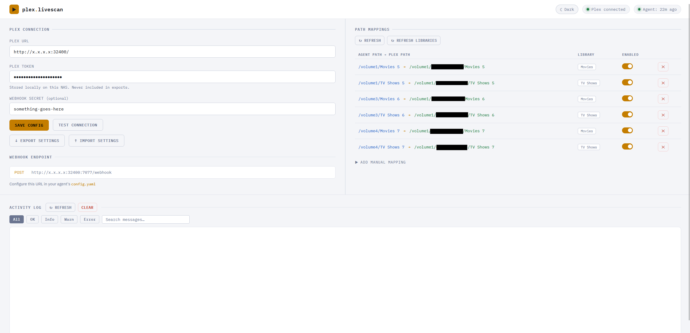
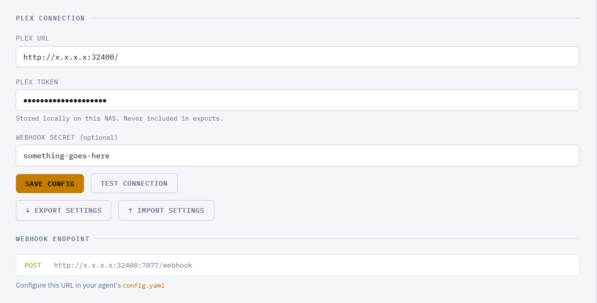
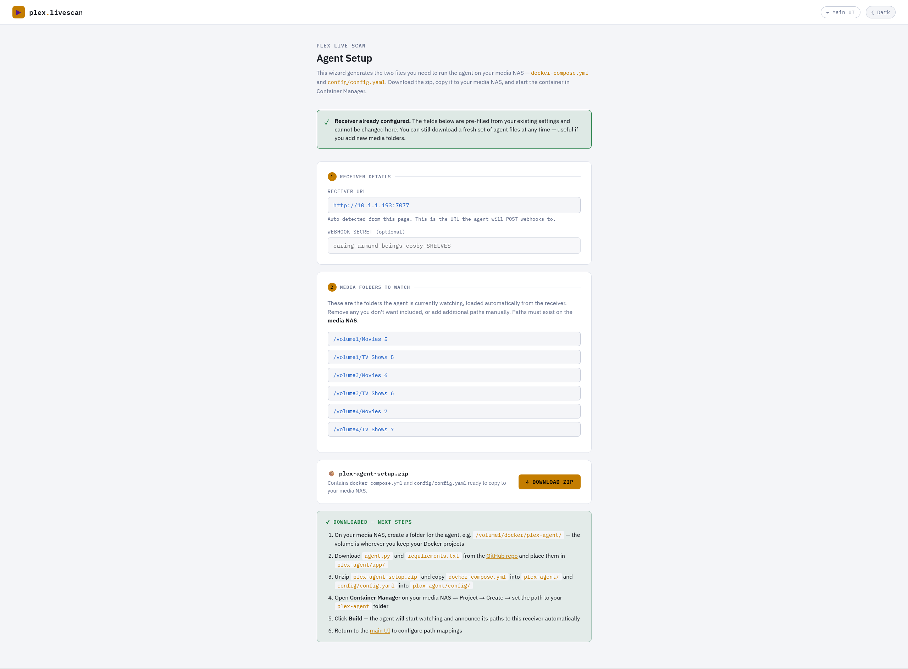

# Plex Live Scan

Event-driven Plex library scanning for Synology NAS. When a file or folder is created, moved, or deleted on your media NAS, Plex Live Scan detects the change instantly and triggers a targeted partial scan — only for the affected folder. No polling, no scheduled scans, no delay.



---

## The problem

If you run Plex on a Synology NAS and store your media on a separate Synology NAS, you've probably run into this: Plex is slow to pick up new content. By default it scans its libraries on a schedule — typically every few hours — which means a newly added TV show or movie can sit there undetected for a long time.

The obvious fix is Plex's built-in **"Automatically detect new content"** option, which uses inotify to watch for file system changes. The catch is that this only works when Plex can watch the folders directly on the same machine it's running on. When your media lives on a different NAS and is accessed over a network share (SMB/NFS), inotify events don't travel across the network — Plex never sees them. The auto-detect option becomes useless, and you're back to waiting for the next scheduled scan.

The common workaround is to trigger Plex scans manually via its API, or to set the scan interval very short. Neither is ideal — manual is tedious, and a very short interval hammers Plex constantly even when nothing has changed.

Plex Live Scan solves this properly. An agent runs directly on the media NAS where the files actually live, so it can use inotify to detect changes the moment they happen. When something changes, it sends a lightweight webhook to the receiver running alongside Plex, which immediately triggers a partial scan of just the affected folder — not the whole library. New content shows up in Plex in seconds, and nothing runs unless something actually changed.

---

## How it works

Plex Live Scan is two separate apps that work together:

| App | Runs on | What it does |
|-----|---------|--------------|
| **plex-live-scan** (Receiver) | Plex NAS | Web UI + API. Receives events, translates paths, calls the Plex scan API |
| **plex-live-scan-agent** (Agent) | Media NAS | Watches media folders via inotify. Sends a webhook to the receiver when something changes |

```
Media NAS                          Plex NAS
┌─────────────────────┐           ┌──────────────────────────┐
│  plex-live-scan-    │  webhook  │  plex-live-scan          │
│  agent              │ ────────► │  (Flask + web UI)        │
│                     │           │                          │
│  inotify watcher    │           │  path mapper             │
│  /volume1/TV Shows  │           │  Plex API caller         │
│  /volume3/Movies    │           │  activity log            │
└─────────────────────┘           └──────────────────────────┘
```

Both containers use `python:3.12-slim` pulled from Docker Hub — no image building required.

---

## Requirements

- Two Synology NAS devices (can be the same device if Plex and your media are co-located)
- **DSM 7.2 or later** on both NAS devices — Container Manager replaced the older Docker package in DSM 7.2 and the setup instructions below assume it
- **Container Manager** installed on both NAS devices (available free from Synology's Package Center)
- Plex Media Server installed and running on one of them
- Your media folders **already mounted and accessible on the Plex NAS** — see below

### Mounting your media on the Plex NAS

The receiver needs to be able to give Plex a local path to scan, so your media folders must be mounted on the Plex NAS as a local path, not just accessible over the network. The most common way to do this on Synology is via **File Station**:

1. On the Plex NAS, open **File Station**
2. Click the **⋯** menu → **Mount Virtual Drive**
3. Enter the SMB/NFS path to the media NAS, e.g. `\\media-nas\TV Shows 5`
4. Choose a local mount point, e.g. `/volume1/MEDIASERVER/TV Shows 5`

That local path (`/volume1/MEDIASERVER/TV Shows 5`) is what you'll use as the **Plex Path** when configuring mappings. If you're already accessing your media this way and Plex can see it, you're all set — just note the local path.

### Finding your Plex token

Your X-Plex-Token authorises the receiver to call the Plex scan API.

1. Open **Plex Web** in your browser and sign in
2. Click any item in your library to open it
3. Click the **⋯** menu on the item → **Get Info** → **View XML**
4. Your browser will open an XML page — look at the URL in the address bar
5. Copy the value of the `X-Plex-Token` parameter at the end of the URL

Alternatively, open your browser's developer tools (F12), go to the **Network** tab, reload Plex, click any request to your Plex server URL, and find `X-Plex-Token` in the request URL or headers.

> **Keep your token private.** It grants full access to your Plex server. In Plex Live Scan it is stored only in the receiver's local database and is deliberately excluded from the settings export.

---

## Part 1 — Receiver (Plex NAS)

### 1. Create the folder structure

```
/volume1/docker/plex-live-scan/
├── docker-compose.yml
├── app/
│   ├── app.py
│   ├── requirements.txt
│   └── templates/
│       └── index.html
└── data/                  ← created automatically on first run
```

Create the directories via SSH or the Synology terminal:

```bash
mkdir -p /volume1/docker/plex-live-scan/{app/templates,data}
```

### 2. Copy the receiver files

Copy `app.py`, `requirements.txt`, `index.html`, and `docker-compose.yml` from the `plex-live-scan/` folder in this repo to the paths above. You can do this via File Station (drag and drop) or SCP.

### 3. docker-compose.yml

```yaml
services:
  plex-live-scan:
    image: python:3.12-slim
    container_name: plex-live-scan
    restart: unless-stopped
    network_mode: host
    volumes:
      - ./app:/app
      - ./data:/data
    working_dir: /app
    command: >
      bash -c "pip install -q -r requirements.txt && python app.py"
```

> **Why `network_mode: host`?**  
> Synology DSM reserves ports 5000 and 5001 for its own web interface. Running in host mode on port 7077 avoids this conflict. Using ports 5000/5001 will cause the container to crash immediately on startup.

> **`restart: unless-stopped`** means the container starts automatically when your NAS boots and restarts itself if it crashes. You don't need to manually start it after a power cut or reboot.

### 4. Start the container

1. Open **Container Manager** on your Plex NAS
2. Go to **Project → Create**
3. Set the path to `/volume1/docker/plex-live-scan`
4. Container Manager will detect `docker-compose.yml` automatically — click **Build**
5. Wait for the status to show **Running**
6. Open `http://<plex-nas-ip>:7077` to confirm the web UI loads

---

## Part 2 — Configure via web UI

Open `http://<plex-nas-ip>:7077`. All configuration is stored in the database — nothing to edit by hand on the receiver side.



### Plex Connection

1. **Plex URL** — your Plex server URL without a trailing slash, e.g. `http://10.1.1.193:32400`
2. **Plex Token** — your X-Plex-Token (see [Finding your Plex token](#finding-your-plex-token) above)
3. **Webhook Secret** — any string you choose. You'll copy this into the agent's `config.yaml`. Used to verify that webhook requests are genuine.
4. Click **Save Config**
5. Click **Test Connection** — the status indicator in the top right should turn green

### Path Mappings

Each mapping tells the receiver how to translate an agent path into the equivalent path as Plex sees it. You need one mapping per media folder.

Once the agent is running it will automatically announce its watched paths to the receiver. They'll appear in the UI under **Needs configuration** — you only need to fill in the Plex path and pick a library section.

1. Click **↻ Refresh Libraries** to load your Plex library sections
2. For each announced agent path, enter the **Plex Path** — the same folder as it's mounted on the Plex NAS, e.g. `/volume1/MEDIASERVER/TV Shows 5`
3. Select the **Library Section** it belongs to (e.g. TV Shows)
4. Click **Configure**

> **Multiple folders, one library:** It's normal for multiple agent paths to map to the same Plex library section. `/volume1/TV Shows 5`, `/volume3/TV Shows 6`, and `/volume4/TV Shows 7` can all map to the same "TV Shows" library — Plex knows which subfolder to scan from the path.

### Webhook Endpoint

The URL shown under **Webhook Endpoint** is what the agent sends events to:

```
http://<plex-nas-ip>:7077/webhook
```

You'll need this when configuring the agent.

---

## Part 3 — Agent (Media NAS)

There are two ways to set up the agent. The setup wizard is the easier option if you're not comfortable editing YAML files.

### Option A — Setup wizard (recommended)

Once the receiver is running and configured, open the setup wizard at:

```
http://<plex-nas-ip>:7077/setup
```



There's also an **Agent Setup** link in the top right of the main UI.

The wizard will:
- Auto-detect the receiver URL and pre-fill it
- Pre-populate your media folder list from paths the agent has already announced (or let you add them manually)
- Generate a ready-to-use `plex-agent-setup.zip` containing `docker-compose.yml` and `config/config.yaml`

After downloading the zip:

1. On your media NAS create a folder for the agent, e.g. `/volume1/docker/plex-agent/` — use whichever volume you keep your Docker projects on
2. Download `agent.py` and `requirements.txt` from the [plex-live-scan-agent repo](https://github.com/your-repo/plex-live-scan-agent) and place them in `plex-agent/app/`
3. Unzip `plex-agent-setup.zip` and copy `docker-compose.yml` into `plex-agent/` and `config/config.yaml` into `plex-agent/config/`
4. Open **Container Manager** on your media NAS → Project → Create → set the path to your `plex-agent` folder
5. Click **Build** — the agent will start and announce its paths to the receiver automatically
6. Return to the main UI to configure path mappings

---

### Option B — Manual setup

#### 1. Create the folder structure

```
/volume1/docker/plex-agent/
├── docker-compose.yml
├── app/
│   ├── agent.py
│   └── requirements.txt
└── config/
    └── config.yaml
```

```bash
mkdir -p /volume1/docker/plex-agent/{app,config}
```

#### 2. Copy the agent files

Copy `agent.py`, `requirements.txt`, `docker-compose.yml`, and `config.yaml` from the `plex-live-scan-agent/` folder to the paths above.

#### 3. Edit config.yaml

```yaml
receiver:
  url: "http://<plex-nas-ip>:7077"   # IP of your Plex NAS
  secret: "your-webhook-secret"       # Must match what you set in the web UI

# Seconds to wait before re-notifying for the same folder.
# Prevents flooding when a full season is added at once.
debounce_seconds: 5

# File and folder name patterns to ignore completely.
ignore_patterns:
  - "@eaDir"     # Synology thumbnail cache — keep this
  - ".tmp"
  - ".part"
  - "~"
  - ".DS_Store"
```

#### 4. Edit docker-compose.yml

Add a volume entry for each media folder you want to watch, mounting it at the **same path on both sides** of the colon:

```yaml
services:
  plex-agent:
    image: python:3.12-slim
    container_name: plex-live-scan-agent
    restart: unless-stopped
    volumes:
      - ./app:/app
      - ./config:/config
      - /volume1/TV Shows 5:/volume1/TV Shows 5:ro
      - /volume3/TV Shows 6:/volume3/TV Shows 6:ro
      - /volume4/TV Shows 7:/volume4/TV Shows 7:ro
      - /volume1/Movies 5:/volume1/Movies 5:ro
      - /volume3/Movies 6:/volume3/Movies 6:ro
      - /volume4/Movies 7:/volume4/Movies 7:ro
    working_dir: /app
    command: >
      bash -c "pip install -q -r requirements.txt && python agent.py"
    environment:
      - CONFIG_PATH=/config/config.yaml
```

> **`:ro`** mounts each folder read-only. The agent never writes to your media.

> **No watch paths in config.yaml:** You don't need to list your media folders in `config.yaml`. The agent automatically discovers which folders to watch by reading its own volume mounts from `/proc/mounts`. Any folder you add to the `volumes` list will be watched — restart the container after making changes.

> **`restart: unless-stopped`** means the agent starts automatically on NAS boot and restarts itself if it crashes.

#### 5. Start the container

1. Open **Container Manager** on your Media NAS
2. Go to **Project → Create**
3. Set the path to `/volume1/docker/plex-agent`
4. Click **Build** and wait for the container to start

#### 6. Verify in the container log

A healthy startup looks like this:

```
INFO     Plex Live Scan Agent starting…
INFO     Auto-discovered 6 watch path(s):
INFO       → /volume1/Movies 5
INFO       → /volume1/TV Shows 5
INFO       → /volume3/Movies 6
INFO       → /volume3/TV Shows 6
INFO       → /volume4/Movies 7
INFO       → /volume4/TV Shows 7
INFO     Agent running. Webhook target: http://<plex-nas-ip>:7077/webhook
INFO     Announced 6 watch path(s) to receiver
```

The agent will now appear in the receiver's web UI with all paths listed under **Needs configuration**.

---

## Testing

1. Create a new folder inside one of your watched media directories using the correct Plex naming format, e.g. `Show Name (Year)` inside `/volume1/TV Shows 5`
2. Wait 5 seconds (the debounce period)
3. Check the Activity Log in the web UI

A successful scan shows three entries:

```
INFO   Change detected on agent: /volume1/TV Shows 5/Show Name (Year)
INFO   Triggering Plex scan: section=1 path=/volume1/MEDIASERVER/TV Shows 5/Show Name (Year)
OK     Scan triggered successfully for /volume1/MEDIASERVER/TV Shows 5/Show Name (Year)
```

### Activity log levels

| Level | Meaning |
|-------|---------|
| `INFO` | Change detected or scan requested |
| `OK` | Plex confirmed the scan was accepted |
| `WARN` | Non-fatal issue — no mapping found, or webhook secret mismatch |
| `ERROR` | Plex returned an error or was unreachable |

---

## Export and import settings

The web UI supports exporting and importing your configuration as a JSON file, useful for backup or migration.

**Included in export:** Plex URL, webhook secret, all path mappings  
**Never exported:** Your Plex token — it's a credential and is always excluded

After importing on a new machine, enter your Plex token in the web UI and save.

---

## Troubleshooting

### "Watch path does not exist, skipping" for all paths on startup

Container Manager didn't fully apply the new volume mounts. **Stop** the project completely, then **Start** it again. Don't use Restart — use Stop then Start. Docker needs a full cycle to pick up volume changes.

### No entries in the Activity Log

The webhook isn't reaching the receiver. Check:

- Agent log confirms `Agent running. Webhook target: http://...`
- `url` in `config.yaml` is the correct IP and port (`7077`) for your Plex NAS
- `secret` in `config.yaml` exactly matches the Webhook Secret saved in the web UI (case-sensitive)
- Port `7077` is not blocked by the Plex NAS firewall
- The Media NAS can reach the Plex NAS on port `7077`

### WARN: no mapping found for path

The path sent by the agent doesn't match any configured mapping. Check that the Agent Path in your mapping matches exactly — including capitalisation and spaces.

### ERROR on scan

Common causes:

- **Trailing slash on Plex URL** — use `http://10.1.1.193:32400` not `http://10.1.1.193:32400/`
- **Expired or revoked Plex token** — generate a new one and update it in the web UI
- **Wrong Plex path** — the translated path must match exactly how Plex has the folder indexed

### Scan succeeds but Plex doesn't add the content

- The folder was empty when the scan ran — add media files and a new scan will trigger automatically
- The folder name doesn't match Plex's naming convention — TV shows expect `Show Name (Year)`, movies expect `Movie Title (Year)`
- Wrong library section assigned to the mapping — click **↻ Refresh Libraries** and re-assign

### @eaDir folders triggering scans

Ensure `@eaDir` is in `ignore_patterns` in `config.yaml` and restart the agent.

### Containers don't start after a NAS reboot

Both `docker-compose.yml` files use `restart: unless-stopped`, so containers should start automatically after a reboot. If they don't, open Container Manager and start the projects manually once — they'll auto-start from then on. You can also check **DSM → Control Panel → Task Scheduler** to ensure Container Manager itself is set to launch on startup.

---

## How scanning works

When a change is detected, the agent doesn't send the full path of the changed file. It collapses the path to the first-level subfolder under the watch root — giving Plex a useful, targeted scan path rather than a deep file path.

**Example:** a file is created at `/volume1/TV Shows 5/The Fall (2013)/Season 1/ep1.mkv`  
The agent sends `/volume1/TV Shows 5/The Fall (2013)` to the receiver.

The receiver translates that to the Plex-side path and calls:

```
GET /library/sections/{id}/refresh?path={plex_path}&X-Plex-Token={token}
```

Plex scans only that specific folder — fast regardless of library size.

### Debouncing

The agent debounces per folder. Multiple file events in the same subfolder within the debounce window (default 5 seconds) send only one webhook. This prevents flooding when an entire season or bulk download arrives at once.

### Path announcement

On startup and every 30 minutes, the agent posts its list of watched paths to the receiver. This keeps the receiver's UI current and allows it to show which paths still need a mapping configured. The agent status indicator in the top right of the web UI shows how long ago it last checked in — it turns red if the agent has been silent for more than 35 minutes.

---

## File reference

### Receiver (`plex-live-scan/`)

| File | Purpose |
|------|---------|
| `app.py` | Flask app — web UI, REST API, Plex integration |
| `requirements.txt` | Python dependencies |
| `templates/index.html` | Web UI |
| `docker-compose.yml` | Container definition |
| `data/config.db` | SQLite database — all config, mappings, activity log (auto-created) |

### Agent (`plex-live-scan-agent/`)

| File | Purpose |
|------|---------|
| `agent.py` | inotify watcher and webhook sender |
| `requirements.txt` | Python dependencies |
| `config/config.yaml` | Receiver URL, secret, debounce, ignore patterns |
| `docker-compose.yml` | Container definition + volume mounts |

---

## Contributing

Bug reports and feature requests are welcome — please open an issue on GitHub. If you're submitting a pull request, please test on a real Synology NAS where possible, as some behaviour (inotify, `/proc/mounts` path encoding) is specific to the Synology environment.

---

## License

MIT